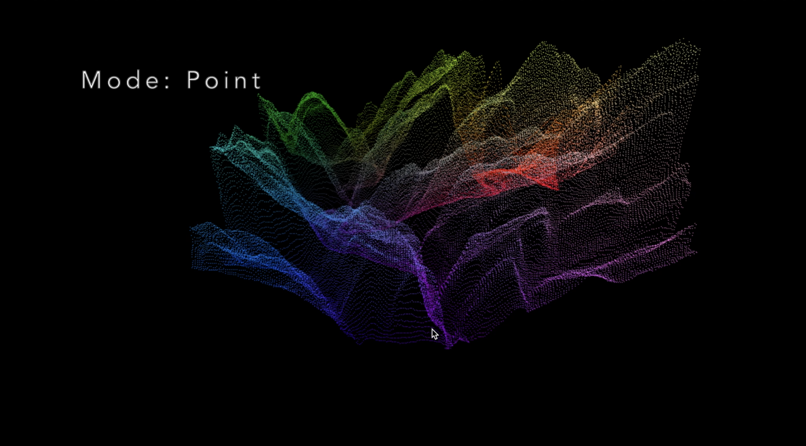
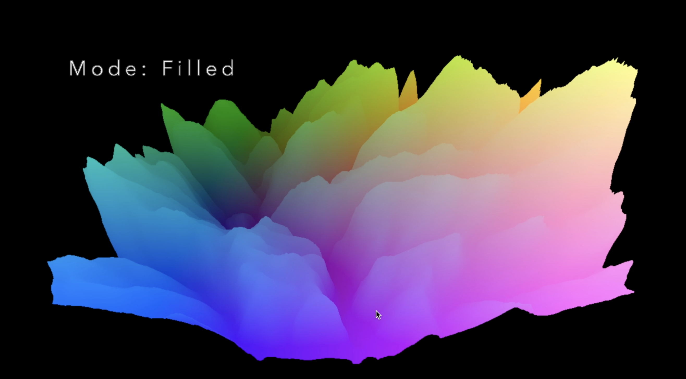
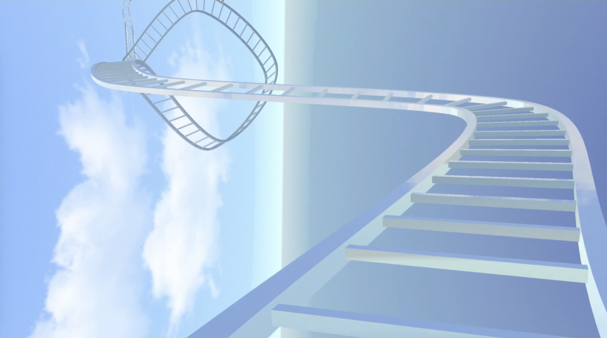
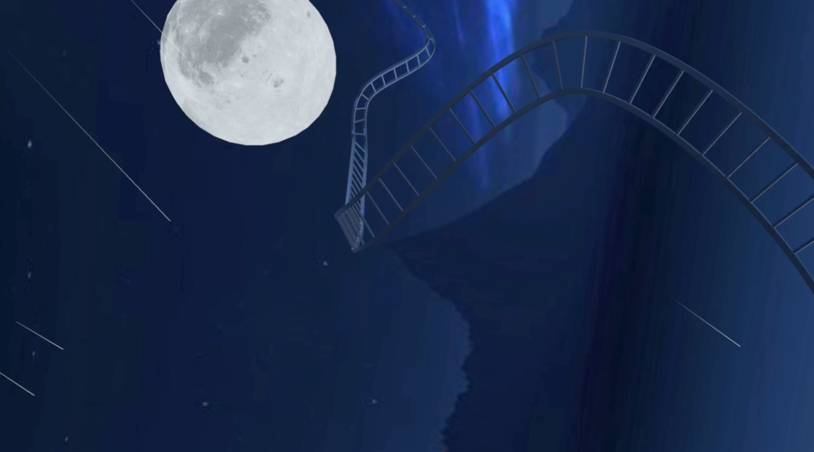
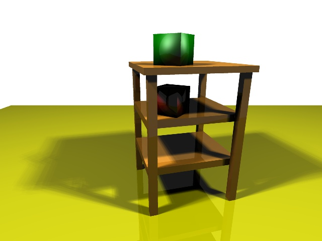
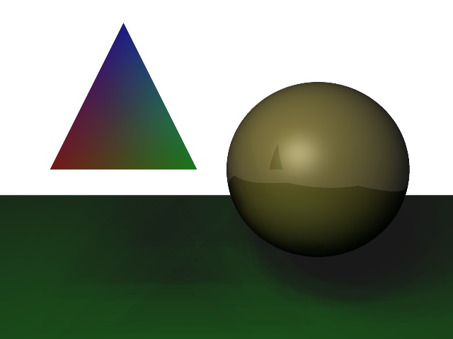

# CSCI 420 Computer Graphics

## Course Information

**Course Name:** CSCI 420 Computer Graphics

**Instructor:** Prof. [Jernej Barbic](http://barbic.usc.edu), USC

This course is an introduction to three-dimensional computer graphics. Students will learn both the theory of 3D computer graphics, and how to program it efficiently using OpenGL. The course primarily teaches the "modern" shader-based OpenGL (core profile), but also introduces the "classic" fixed-function OpenGL (compatibility profile). Topics include 2D and 3D transformations, Bézier and B-Spline curves for geometric modeling, interactive 3D graphics programming, computer animation and kinematics, and computer graphics rendering including ray tracing, shading and lighting. 

## Assignments
### Assignment1
**Demo Video**: [**https://youtu.be/ZzU1abfrd6g**](https://youtu.be/ZzU1abfrd6g)  
      
Description: The code takes a 2D heightmap as input and converts it to 3D point cloud. There are three rendering methods for demostration, including point mode, line mode and filled mode. Users can also interact with the point cloud to make deformation. [Details](http://barbic.usc.edu/cs420-s20/assign1/index.html)  

Change Mode:  
Key P: Point Mode  
Key L: Line Mode  
Key F: Filled Mode  

Make Deformation:  
Key T + LeftMouse and RightMouse: Translation  
Key R + LeftMouse and RightMouse: Rotation  
Key S + LeftMouse and RightMouse: Scaling  

### Assignment2
**Demo Video**: [**https://youtu.be/ZoYw3fEaAzE**](https://youtu.be/ZoYw3fEaAzE)    
     
Description: Use Catmull-Rom splines along with OpenGL core profile shader-based lighting and texture mapping to create a roller coaster simulation. [Details](http://barbic.usc.edu/cs420-s20/assign2/index.html)  

Features:
1. Render a T-shape rail cross-section and double rail.  
2. Texture of rail simulates the effect of glass.  
3. Render different sky-box and light color for day mode and night mode.  
4. Render a sphere as moon with realistic texture for night mode.  
5. Create comets crossing the sky at random speed and length.
6. Press 'p' to stop and continue roller coaster.  

### Assignment3  
**Demo**:  
     
Description: Build a ray tracer which is able to deal with spheres and triangles. The color in each pixel is calculated based on Phong shading. [Details](http://barbic.usc.edu/cs420-s20/assign3/index.html)  

Features:
1. Recursive reflection.
2. Use antialising.
3. Apply soft shadows.

